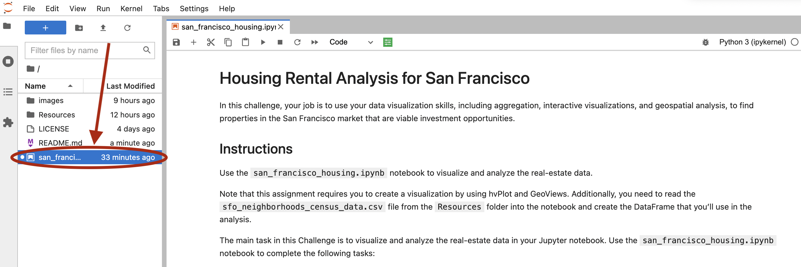

# RentalInsight

A PropTech analytical notebook for finding viable rental investment opportunities.

---

## Technologies

* **Pandas** - A python library with advanced financial analysis tools.
* **Jupyter Lab** - An IDE used for visualization.
* **anaconda** - A python framework consisting of several tools used in financial analysis, such as Pandas and Jupyter Lab.
* **hvplot** - A set of python visualization tools used to create compelling, and interactive visualizations.  

---

## Installation Guide

### Prerequisites
The following are required to use this analytical notebook
* Python 3.7+
* Anaconda
* Jupyter Lab
* Pandas
For instructions on how to install these and how to run Jupyter Lab, please refer to *Installation Guide* found at [Cryptage](https://github.com/CAMPSMITH/cryptage.git)

### PyViz
To install PyViz in your conda virtual environment, first start your virtual environment, and then use the following command to install the PyViz tools:
```
conda install -c pyviz hvplot geoviews
```

---

## Usage

### Running the RentalInsight Notebook
Once Jupyter Lab has started in your browser, select the *san_francisco_housing.ipynb* notebook from the Left Sidebar.

---

## Contributors

*  **Martin Smith** <span>&nbsp;&nbsp;</span> |
<span>&nbsp;&nbsp;</span> *email:* msmith92663@gmail.com <span>&nbsp;&nbsp;</span>|
<span>&nbsp;&nbsp;</span> [](https://www.linkedin.com/in/smithmartinp/)


---

## License

[](LICENSE)